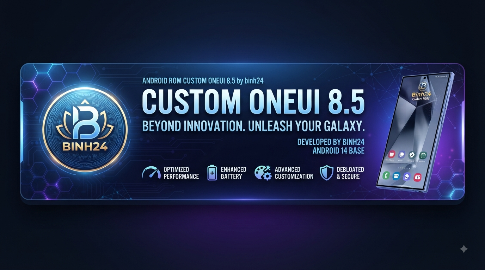

<h1 align="center">
  
</h1>
======================
                         [ ANDROID CUSTOM ROM ]
                             ONEUI 8.5
======================

    [+] Developer: binh24
    [+] Status: Stable / Optimized / Feature-Rich
    [+] Platform: Next-Gen Samsung Experience

------------------------------------------------------------------------
 > KEY FEATURES & HIGHLIGHTS:
   * Smooth & Fluid Animations
   * Advanced Customization Hub
   * Enhanced Battery Life & Performance
   * Debloated & Privacy Focused
------------------------------------------------------------------------

                  "Redefining Your Galaxy Experience"
========================================================================

\* Exynos990

### UN1CA-exclusive features:
- Native/live blur toggle
- One UI Home animations option
- Vulkan renderer toggle
- Key attestation spoof ([TrickyStore](https://github.com/5ec1cff/TrickyStore)) options*
- Play Integrity Fix integrated
- Ability to hide installed apps ([Hide My Applist](https://github.com/Dr-TSNG/Hide-My-Applist))
- Ability to hide developer options
- Allow app downgrade toggle
- Allow installing apps with old targetSdk toggle
- Allow secure screenshot toggle
- Screenshot/screen recording detection toggle
- Unlimited backup storage on Google Photos
- Games FPS unlock toggle

\* Requires a valid keybox

# Licensing
This project is licensed under the terms of the [GNU General Public License v3.0](LICENSE). External dependencies might be distributed under a different license, such as:
- [android-tools](https://github.com/nmeum/android-tools), licensed under the [Apache License 2.0](https://github.com/nmeum/android-tools/blob/master/LICENSE)
- [apktool](https://github.com/iBotPeaches/Apktool), licensed under the [Apache License 2.0](https://github.com/iBotPeaches/Apktool/blob/master/LICENSE.md)
- [erofs-utils](https://github.com/sekaiacg/erofs-utils/), dual license ([GPL-2.0](https://github.com/sekaiacg/erofs-utils/blob/dev/LICENSES/GPL-2.0), [Apache-2.0](https://github.com/sekaiacg/erofs-utils/blob/dev/LICENSES/Apache-2.0))
- [img2sdat](https://github.com/xpirt/img2sdat), licensed under the [MIT License](https://github.com/xpirt/img2sdat/blob/master/LICENSE)
- [platform_build](https://android.googlesource.com/platform/build/) (ext4_utils, f2fs_utils, signapk), licensed under the [Apache License 2.0](https://source.android.com/docs/setup/about/licenses)

# Contributors

# Credits:
- **[salvogiangri](https://github.com/salvogiangri)** for the UN1CA build system, OneUI patches, and general help and support while developing.
- **[ExtremeXT](https://github.com/ExtremeXT)** for helping me fix bugs and giving me support.
- **[GhasemzadehFard-Dev](https://github.com/GhasemzadehFard-Dev)** for helping fix many bugs I was not able to fix.
- **[Mesazane](https://github.com/Mesazane)** for testing and helping with the updaters design, and for updating and fixing KernelSU-Next on the Kernels.
- **[ricci205GTI](https://github.com/ricci205GTI)** for fixing motion photo and help with the x1s.
- **[immohammeeed](https://github.com/immohammeeed)** for creating the website for this project.
- **[3q5i](https://github.com/3q5i)** for support and ideas for the ROM.
- **[irvinhaha](https://github.com/irvinhaha)** for designing many banners and logos
- **[CiprianDinca](https://github.com/CiprianDinca9)** for custom ExtremeROM ringtones
- **[Dupazlasu/Milxnaq](https://github.com/milxnaq)** for fixing bluetooth on the S10x and much more
- More that I can't remember right now and will have to be added in the future

## Original UN1CA credits:
A special thanks goes to the following for their invaluable contributions in no particular order:
- **[ShaDisNX255](https://github.com/ShaDisNX255)** for his help, time and for his [NcX ROM](https://github.com/ShaDisNX255/NcX_Stock) which inspired this project
- **[DavidArsene](https://github.com/DavidArsene)** for his help and time
- **[paulowesll](https://github.com/paulowesll)** for his help and support
- **[Simon1511](https://github.com/Simon1511)** for his support and some of the device-specific patches
- **[ananjaser1211](https://github.com/ananjaser1211)** for troubleshooting and his time
- **[Fede2782](https://github.com/Fede2782)** for his contributions and help with Exynos/MTK support
- **[iDrinkCoffee](https://github.com/iDrinkCoffee-TG)** and **[RisenID](https://github.com/RisenID)** for their support
- **[LineageOS Team](https://www.lineageos.org/)** for their original [OTA updater implementation](https://github.com/LineageOS/android_packages_apps_Updater)
- *All the UN1CA project forks, contributors, testers and users ❤️*
